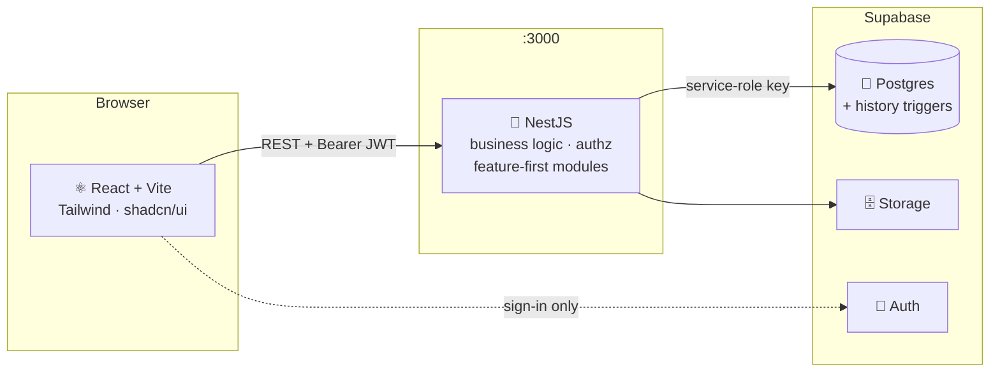
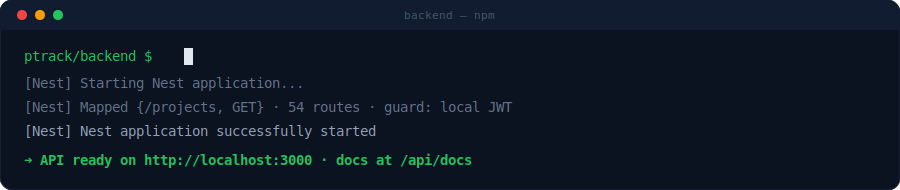
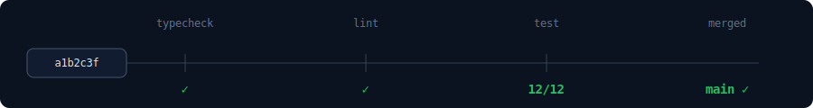

<div align="center">



<br/>

[](https://github.com/DevEnchantments/ptrack/actions/workflows/ci.yml)


**A ground-up rebuild of an enterprise Oracle APEX PPM application as a modern web stack.**


</div>

---

## ✨ What's inside

<div align="center">

</div>

| | Feature | Notes |
|---|---|---|
| 📁 | **Full CRUD, 9 record types** | Milestones, Action Items, Issues, Links, Resources, Updates, Status Reports, Attachments, People |
| 🧙 | **4-step Project Wizard** | Plus edit, delete, restricted-project locking and orphaned-Storage cleanup |
| 🕓 | **Field-level History** | Postgres trigger writes one audit row per changed field — values resolved at write time, so history shows what a value *was* |
| 🗑️ | **Deletion audit** | Every delete records *who* removed *what*, with a two-step confirm in the UI |
| 📎 | **File attachments** | Supabase Storage backed, with gold-flagging and tagging |
| 📖 | **Live API docs** | Swagger at `/api/docs` with runnable request examples |
| 🔐 | **Local JWT verification** | Supabase tokens verified in-process (JWKS) — no per-request auth round-trip |
| ✅ | **CI-gated** | Typecheck, lint, build and tests on every push |

<div align="center">

</div>

## 🏗 Architecture



<div align="center">

</div>

> **The one hard rule:** the React app **never** talks to Supabase data directly.
> Everything flows **React → NestJS → Supabase**. The frontend touches Supabase
> for authentication only. (RLS is deliberately deferred to a later security phase —
> authorization lives in the NestJS layer.)

## 🚀 Quick start

**Prerequisites:** Node 22+, a [Supabase](https://supabase.com) project.

### 1 · Database — Supabase SQL editor

Run these once, in order:

| Script | Purpose |
|---|---|
| `backend/db/ptrack_phase1_schema.sql` | All 28 tables, triggers, indexes |
| `backend/db/record_history.sql` | Field-level audit capture + backfill |
| `backend/db/record_history_deleted.sql` | Extends the audit to deletions |

### 2 · Backend — `:3000`

```bash
cd backend
npm install
npm run dev
```

<div align="center">

</div>

Create `backend/.env`:

| Variable | Required | What it is |
|---|---|---|
| `SUPABASE_URL` | ✅ | Project URL — dashboard → Settings → API |
| `SUPABASE_SECRET_KEY` | ✅ | Service-role / secret key (**server only, never the browser**) |
| `SUPABASE_JWT_SECRET` | optional | Only for legacy HS256 projects; modern projects verify via public JWKS automatically |

### 3 · Frontend — `:5173`

```bash
cd frontend
npm install
npm run dev
```

Create `frontend/.env.local`:

| Variable | Required | What it is |
|---|---|---|
| `VITE_SUPABASE_URL` | ✅ | Same project URL |
| `VITE_SUPABASE_PUBLISHABLE_KEY` | ✅ | The *publishable* (anon) key — safe for the browser |

> 💼 **Corporate proxy / TLS interception?** Set `NODE_OPTIONS=--use-system-ca`
> in your shell before any `npm` network call.

### 4 · Explore

- App → <http://localhost:5173>
- API docs (Swagger, non-production only) → <http://localhost:3000/api/docs>

## 🧪 Quality

```bash
cd backend && npm test        # unit tests (audit diffing, auth guard verify/fallback)
npx tsc --noEmit              # typecheck — clean in both halves
npx eslint "src/**/*.ts"      # backend lint — zero errors, CI-blocking
```

CI runs all of the above plus full builds for every push and pull request.

<div align="center">

</div>

## 🗺 Roadmap

Phase 1 (full CRUD + audit history) is complete. Next up, roughly in order of appetite:
**dashboards & reporting** (Gantt · timeline · heatmap) · **Code Table Administration** ·
**search & saved searches** · **email/notification subsystem** · **Flex Columns**
(no-code custom fields) · **RLS enforcement**.

<div align="center">

</div>

## 📚 More docs

| File | What it covers |
|---|---|
| [`CLAUDE.md`](CLAUDE.md) | Architecture rules, conventions, known gotchas — read before contributing |
| [`original-app-features.md`](original-app-features.md) | Feature reference for the original Oracle APEX application being rebuilt |

<div align="center">


<sub>Built as an independent rebuild — no access to the original database, only its demo. 1:1 parity is not the goal; a better P-Track is.</sub>


</div>
