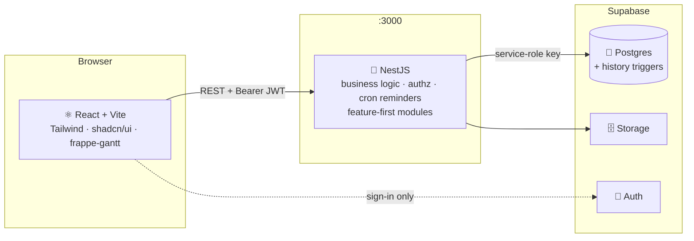
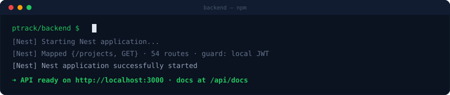
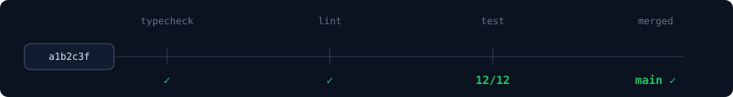

<div align="center">



<br/>

[](https://github.com/DevEnchantments/ptrack/actions/workflows/ci.yml)


**A ground-up rebuild of an enterprise Oracle APEX PPM application — now a full
portfolio suite governed by the Project Tracker FDD.**


</div>

---

## ✨ What's inside

<div align="center">

</div>

| | Feature | Notes |
|---|---|---|
| 📁 | **Full CRUD, 13 record types** | Milestones (under numbered Outcomes), Action Items, Issues, Risks, Links, Resources, Updates, Status Reports, Attachments, People, KPIs |
| 📊 | **Live dashboard** | 9 hand-rolled SVG/CSS chart types over real aggregates — stats, trends, flow, heatmap |
| 🧮 | **Progress & risk formulas** | Weighted milestone progress, planned-vs-actual, risk scoring — provisional set charted in `docs/FORMULAS.md` |
| 🔄 | **Reporting-cycle workflow** | Monthly cycles, submit → review → validate → approve state machine with a mandatory-field gate |
| 🔔 | **Notifications & reminders** | In-app center plus a daily scheduler for due-soon/overdue items (replan-aware dedup) |
| 🔎 | **Global search** | Ctrl+K palette across six record kinds, with per-user saved searches |
| 📅 | **Portfolio timeline** | frappe-gantt Gantt with drag-to-reschedule that writes through the API (and history) |
| 🗂 | **Cross-project registers** | Milestones, Action Items, People directory, Categories, Tags, project Tree view |
| 📦 | **Bulk CSV import/export** | Column-mapped import with validated preview-before-commit; one-click register export |
| 📋 | **Project Templates** | Snapshot outcomes + weighted milestones; instantiate with the schedule shifted to a new start date |
| 👤 | **Account provisioning** | Pending people become real logins (Supabase Admin API) with auto-claimed memberships and an invitation drafter |
| ⚙️ | **Code Table Administration** | Every dropdown's values are ID'd, admin-editable rows — rename, reorder, deactivate |
| 🕓 | **Field-level history + deletion audit** | Postgres triggers record what a value *was*; every delete records who removed what |
| 📖 | **Live API docs** | Swagger at `/api/docs` with runnable request examples |
| ✅ | **CI-gated** | Typecheck, lint (zero errors, blocking), build and 44 unit tests on every push |

<div align="center">

</div>

## 🏗 Architecture


```mermaid
flowchart LR
    subgraph Browser
        R["⚛️ React + Vite<br/>Tailwind · shadcn/ui · frappe-gantt"]
    end
    subgraph API [":3000"]
        N["🪺 NestJS<br/>business logic · authz · cron reminders<br/>feature-first modules"]
    end
    subgraph Supabase
        P[("🐘 Postgres<br/>+ history triggers")]
        A["🔑 Auth"]
        S["🗄️ Storage"]
    end

    R -- "REST + Bearer JWT" --> N
    N -- "service-role key" --> P
    N --> S
    R -. "sign-in only" .-> A
```

<div align="center">

</div>

> **The one hard rule:** the React app **never** talks to Supabase data directly.
> Everything flows **React → NestJS → Supabase**. The frontend touches Supabase
> for authentication only. (RLS is enabled deny-all; policies and role
> enforcement are the upcoming security phase — authorization lives in the
> NestJS layer.)

## 🚀 Quick start

**Prerequisites:** Node 22+, a [Supabase](https://supabase.com) project.

### 1 · Database — Supabase SQL editor

Run the core three first, in order:

| Script | Purpose |
|---|---|
| `backend/db/ptrack_phase1_schema.sql` | Core tables, triggers, indexes |
| `backend/db/record_history.sql` | Field-level audit capture + backfill |
| `backend/db/record_history_deleted.sql` | Extends the audit to deletions |

Then run the feature migrations — **all idempotent**, order-insensitive among
themselves: every `backend/db/fdd_*.sql` (project fields, register columns,
person fields, stakeholders/sector/programs, outcomes, risks, issue fields,
workflow, notifications, KPIs), plus `issue_reference_identifier.sql`,
`milestone_original_due_date.sql`, `search_saved.sql`, `project_templates.sql`,
`pending_member_email.sql`, `db/replace_action_item_owners.sql` (repo-root
`db/`), and finally `backend/db/enable_rls_lockdown.sql`.

### 2 · Run both halves

```bash
dev.cmd          # Windows launcher — starts backend (:3000) + frontend (:5173)
```

or individually:

```bash
cd backend  && npm install && npm run dev    # NestJS on :3000
cd frontend && npm install && npm run dev    # Vite on :5173
```

<div align="center">

</div>

Create `backend/.env`:

| Variable | Required | What it is |
|---|---|---|
| `SUPABASE_URL` | ✅ | Project URL — dashboard → Settings → API |
| `SUPABASE_SECRET_KEY` | ✅ | Service-role / secret key (**server only, never the browser**) |
| `SUPABASE_JWT_SECRET` | optional | Only for legacy HS256 projects; modern projects verify via public JWKS automatically |

Create `frontend/.env.local`:

| Variable | Required | What it is |
|---|---|---|
| `VITE_SUPABASE_URL` | ✅ | Same project URL |
| `VITE_SUPABASE_PUBLISHABLE_KEY` | ✅ | The *publishable* (anon) key — safe for the browser |

> 💼 **Corporate proxy / TLS interception?** Set `NODE_OPTIONS=--use-system-ca`
> in your shell before any `npm` network call.

### 3 · Optional: demo data

```bash
cd backend
npm run seed:demo         # 8-project health portfolio, KPIs, cycle submissions
npm run seed:demo:wipe    # removes exactly the demo rows, nothing else
```

### 4 · Explore

- App → <http://localhost:5173>
- API docs (Swagger, non-production only) → <http://localhost:3000/api/docs>

## 🧪 Quality

```bash
cd backend && npm test        # 44 unit tests — formulas, reminders, import resolution, claim planning, auth guard
npx tsc --noEmit              # typecheck — clean in both halves
npx eslint "src/**/*.ts"      # lint — zero errors, CI-blocking on both halves
```

CI runs all of the above plus full builds for every push and pull request.

<div align="center">

</div>

## 🗺 Roadmap

Everything buildable independently is **shipped**: Phase 1 CRUD + audit, the
assumed-FDD build (formulas, workflow, dashboards, KPIs, notifications), and
the portfolio suite (search, timeline, registers, import, templates, accounts).
What remains is gated: **security phase** (role enforcement + RLS policies —
next up) · **supervisor sign-off** (formulas, field behaviors, KPI linkage) ·
**SMTP** (real email sending) · **LLM key** (AI-drafted invitations, the AI
Assistant). Consciously unplanned: Project Merge, Validations.

<div align="center">

</div>

## 📚 More docs

| File | What it covers |
|---|---|
| [`docs/FDD-ALIGNMENT.md`](docs/FDD-ALIGNMENT.md) | The living map of FDD ⇄ P-Track — every requirement, assumption, and open question |
| [`docs/FORMULAS.md`](docs/FORMULAS.md) | The provisional formula charter (F1–F4) awaiting sign-off |
| [`docs/UI-AUDIT.md`](docs/UI-AUDIT.md) | The staged visual-restyling audit (completed) |
| [`CLAUDE.md`](CLAUDE.md) | Architecture rules, conventions, known gotchas — read before contributing |
| [`original-app-features.md`](original-app-features.md) | Historical reference only — the FDD governs; this documents the original APEX app |

<div align="center">


<sub>Built as an independent rebuild — no access to the original database, only its demo. 1:1 parity is not the goal; a better P-Track is.</sub>


</div>
